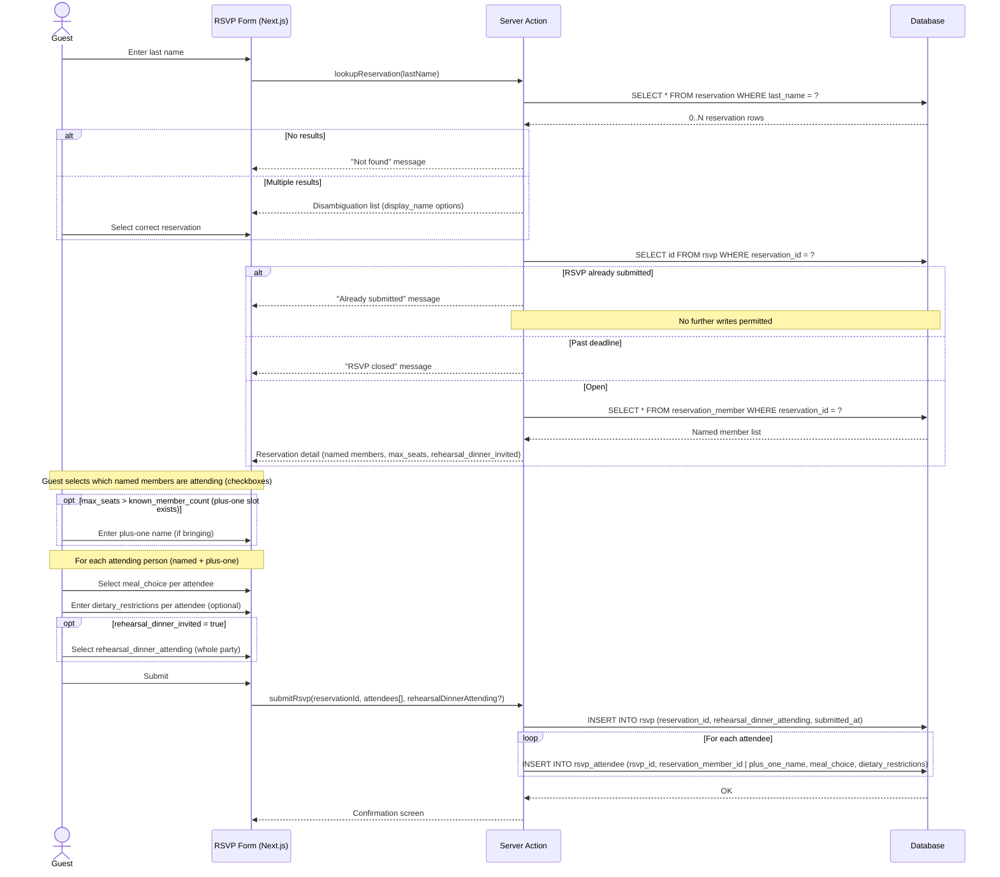
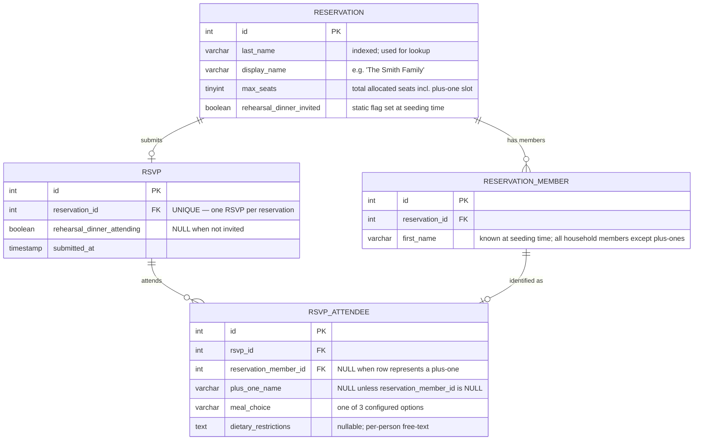

# RSVP Feature — Architecture Overview

## 1. Context

The existing RSVP form (a single name + checkbox → Google Sheets append) is being replaced with a full reservation-lookup-and-response flow. The application is a **Next.js (SSR) container** running on an **OCI Compute instance**.

---

## 2. High-Level User Flow

Key behavioral constraints derived from requirements:

| Constraint | Behavior |
| :--- | :--- |
| No self-service edits | Once an RSVP row exists for a reservation, the form rejects further submissions |
| RSVP deadline | Server Action checks current date against a configurable deadline before accepting a submission |
| Rehearsal dinner | Flag lives on `RESERVATION`; only shown in the form when `rehearsal_dinner_invited = true`. If attending, the **entire reservation** attends — no per-seat split |
| Last name collision | Lookup returns all matching `RESERVATION` rows; guest selects via `display_name` |
| Full decline | Guest deselects all named members; no `RSVP_ATTENDEE` rows are stored |
| Named members | Pre-seeded for all known household members; plus-one name is entered by the guest at RSVP time |
| Per-person meal | Each attending `RSVP_ATTENDEE` row carries its own `meal_choice` and `dietary_restrictions` to support named place cards |

---

## 3. Data Model

### 3.1 Entity Descriptions

#### `RESERVATION` _(seeded by operator; not written by guests)_

| Column | Type | Notes |
| :--- | :--- | :--- |
| `id` | INT PK | Surrogate key |
| `last_name` | VARCHAR | **Indexed**. Case-insensitive lookup surface |
| `display_name` | VARCHAR | Human-readable disambiguation label, e.g. `"The Smith Family"` or `"John & Jane Smith"` |
| `max_seats` | TINYINT | Total allocated seats including any plus-one slot |
| `rehearsal_dinner_invited` | BOOLEAN | Static flag; set at seeding time |

> **Why it matters**: `RESERVATION` is the pre-seeded source of truth. Guests cannot create or modify it — they can only submit an `RSVP` against it. This prevents fraudulent or typo-driven records.

---

#### `RESERVATION_MEMBER` _(seeded by operator; one row per known household member)_

| Column | Type | Notes |
| :--- | :--- | :--- |
| `id` | INT PK | Surrogate key |
| `reservation_id` | INT FK | Parent reservation |
| `first_name` | VARCHAR | Known at seeding time. Last name is inherited from `RESERVATION`. |

> **Why it matters**: Pre-seeding named members drives the form's per-person UI — guests see checkboxes with real names rather than anonymous seat numbers. This is what enables named place cards at the plated dinner. Plus-one slots are intentionally **not** pre-seeded; a plus-one `RSVP_ATTENDEE` row is created at submission time instead.

---

#### `RSVP` _(one row per reservation; immutable after insert)_

| Column | Type | Notes |
| :--- | :--- | :--- |
| `id` | INT PK | Surrogate key |
| `reservation_id` | INT FK UNIQUE | **UNIQUE constraint** enforces one RSVP per reservation |
| `rehearsal_dinner_attending` | BOOLEAN | `NULL` when `rehearsal_dinner_invited = false`. Applies to the entire party. |
| `submitted_at` | TIMESTAMP | Server-assigned on insert; not guest-supplied |

> **Why it matters**: The `UNIQUE` constraint on `reservation_id` is the database-level guard against duplicate submissions — it does not rely solely on application logic. `attending_count` is no longer stored explicitly; it is derived from `COUNT(rsvp_attendee WHERE rsvp_id = ?)` when needed.

---

#### `RSVP_ATTENDEE` _(one row per attending person; replaces `MEAL_SELECTION`)_

| Column | Type | Notes |
| :--- | :--- | :--- |
| `id` | INT PK | Surrogate key |
| `rsvp_id` | INT FK | Parent RSVP |
| `reservation_member_id` | INT FK | `NULL` when this row represents a plus-one |
| `plus_one_name` | VARCHAR | `NULL` unless `reservation_member_id` is `NULL`. Required for plus-one rows. |
| `meal_choice` | VARCHAR | One of 3 configured options (TBD) |
| `dietary_restrictions` | TEXT | Nullable; per-person free-text |

> **Why it matters**: Tying a meal choice and dietary restrictions to a named individual (via `reservation_member_id`) or a named plus-one (via `plus_one_name`) gives the caterer and seating coordinator everything needed to produce accurate place cards. The mutual exclusivity of `reservation_member_id` / `plus_one_name` is enforced via a CHECK constraint: exactly one must be non-null.

---

### 3.2 What Is Intentionally Excluded

- **Audit / change log** — Not needed; submissions are immutable and edits are handled out-of-band.
- **Admin table** — No admin UI in scope for this iteration.
- **Rehearsal dinner per-person tracking** — Headcount only; no individual RSVP_ATTENDEE linkage to rehearsal dinner is required.

---

## 4. Data Layer Recommendation

### Decision: Self-managed SQLite with a persistent Docker volume

| Factor | Assessment |
| :--- | :--- |
| **Scale** | 50–100 reservations, ~150 RSVP rows max. Trivially small. |
| **Concurrency** | Wedding RSVPs are low-frequency sequential writes. SQLite's write lock is not a bottleneck. |
| **Cost** | Zero. No managed service charges. |
| **Ops overhead** | Zero additional infrastructure. Database is a single file mounted as a Docker volume on the existing OCI Compute instance. |
| **Persistence** | Docker volume survives container restarts and redeployments as long as the volume is not destroyed. |
| **Query needs** | Lookup by last name + simple inserts. No analytical queries, joins across many tables, or full-text search required. |
| **Node.js ecosystem** | `better-sqlite3` (synchronous) or `@libsql/client` (async) are mature, well-supported drivers compatible with Next.js Server Actions. |

### Why Not a Managed Service

| Option | Why Deferred |
| :--- | :--- |
| OCI MySQL HeatWave (Always Free) | Adds a network hop, connection pool management, and IAM configuration for negligible benefit at this scale. |
| OCI Autonomous Database | Requires Oracle Wallet and thick client in the container image — meaningful complexity increase for a 100-row dataset. |
| PostgreSQL on a second Compute instance | Doubles compute footprint; overkill for this workload. |

### Upgrade Path

If a future iteration adds an admin dashboard, concurrent multi-instance deployments, or reporting, the schema is standard SQL and migrates to MySQL or PostgreSQL with no structural changes.

---

## 5. Interface Contract Summary

| Interface | Direction | Shape |
| :--- | :--- | :--- |
| `lookupReservation(lastName)` | Browser → Server Action | Input: `string`; Output: `{ id, displayName, maxSeats, rehearsalDinnerInvited, members: { id, firstName }[] }[]` |
| `submitRsvp(reservationId, payload)` | Browser → Server Action | Input: `{ reservationId, rehearsalDinnerAttending?, attendees: { reservationMemberId?, plusOneName?, mealChoice, dietaryRestrictions? }[] }`; Output: success or typed error |
| RSVP deadline | Server-side config | Environment variable `RSVP_DEADLINE` (ISO date string); checked in Server Action before any write |
| Duplicate guard | Database constraint | `UNIQUE(reservation_id)` on `RSVP` table — constraint violation surfaced as "already submitted" to the user |
| Plus-one integrity | Database CHECK constraint | On `RSVP_ATTENDEE`: exactly one of `reservation_member_id` or `plus_one_name` must be non-null |

---

## 6. TBD / Information Requested

- **TBD-1**: The 3 meal choice option labels — needed to finalize `meal_choice` column values (enum or check constraint).
- **TBD-2**: Seeding mechanism — will records be imported via a one-time migration script from the existing spreadsheet, or entered through a manual SQL process? This affects whether a seed script (including `RESERVATION_MEMBER` rows) needs to be part of the deliverable.
- **TBD-3**: RSVP deadline date — needed to configure the `RSVP_DEADLINE` environment variable.
- **TBD-4**: Dietary restrictions scope — assumed **per-person** (moved from party-wide) to align with named place cards. Confirm this is correct.
- **TBD-5**: Children at family reservations — do any seats belong to children, and does the caterer need to distinguish child vs. adult meal options, or are the same 3 options offered to all seats regardless of age?

---
<small>Generated with GitHub Copilot as directed by collin</small>
